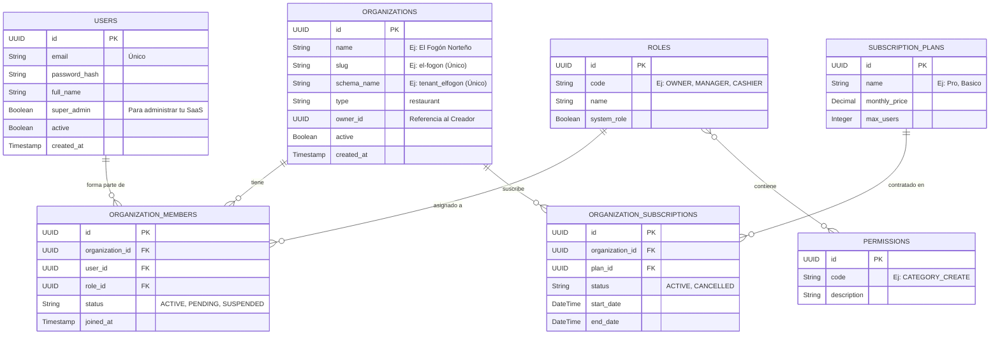

# Diseño de Base de Datos - Esquema Admin (SaaS Central)

En una arquitectura de **Schema per Tenant** (Esquema por Inquilino), existe un esquema maestro o central que gobierna toda la plataforma. En tu proyecto, este es el esquema `public`.

A diferencia de los esquemas de cada restaurante, el **Esquema Admin** guarda la información de **quién paga, quién entra y a qué restaurante pertenece**. Tienes toda la razón en que debemos documentar las tablas **exactas** de tu código.

---

## 🏗️ Diagrama Entidad-Relación (Admin Schema)

Este diagrama representa fielmente las entidades JPA que ya existen en tu módulo `adminsaas` y `security`:

---

## 📖 Diccionario de Tablas Centrales (Tus Módulos Reales)

### 1. `organizations` (Los Restaurantes / Inquilinos)
La tabla madre de todo el SaaS (Módulo: `organizations`). Cuando un cliente se registra en tu sistema, se inserta una fila aquí.
*   **A destacar:** El campo `schema_name` es el puente mágico. Cuando un usuario hace login, buscas su Organización aquí y sabes al instante a qué esquema de PostgreSQL debes redirigir sus consultas de JPA.

### 2. `users` (Identidad Global)
Aquí viven todas las identidades de acceso (Módulo: `users`). 
*   **¿Por qué aquí y no en el esquema del restaurante?** El email es global. Un mismo usuario (`jcasve141@gmail.com`) podría teóricamente trabajar para el restaurante "El Fogón" y "La Pizzería". 

### 3. `organization_members` (El Nivel de Acceso)
Es la tabla intermedia que une a un `users` con un `organizations` y le asigna un rol (Módulo: `members`). De esta forma un usuario puede ser "Dueño" en su restaurante y "Cajero" en el de un amigo.

### 4. `roles` & `permissions` (Seguridad)
Controla qué Endpoints puede tocar cada persona. (Módulo: `shared/security/permissions`). Se inyectan en tu `CustomPermissionEvaluator`.

### 5. `subscription_plans` & `organization_subscriptions`
El núcleo de tu negocio SaaS (Módulo `subscriptions`). Controla los límites de planes (cuántos usuarios pueden crear) y vigila que el restaurante haya pagado su suscripción antes de permitirles entrar.
