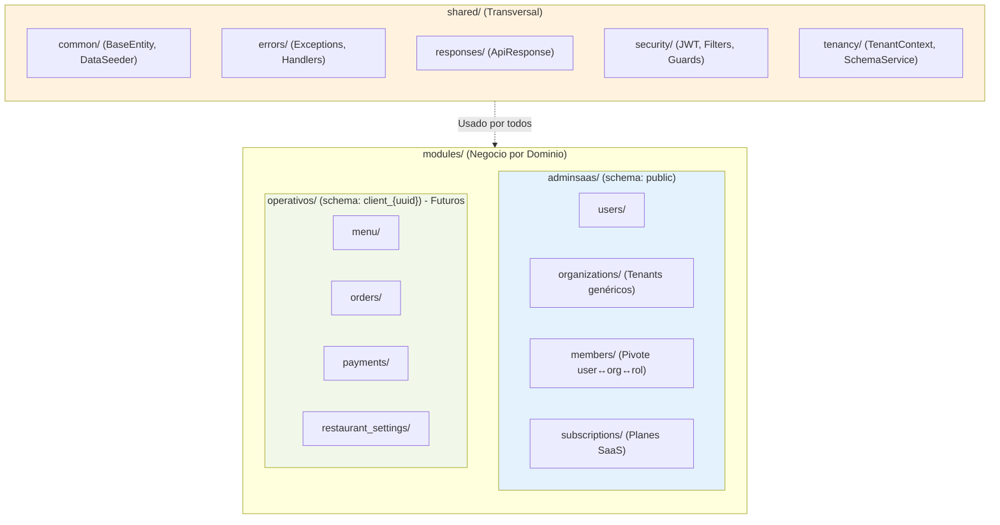
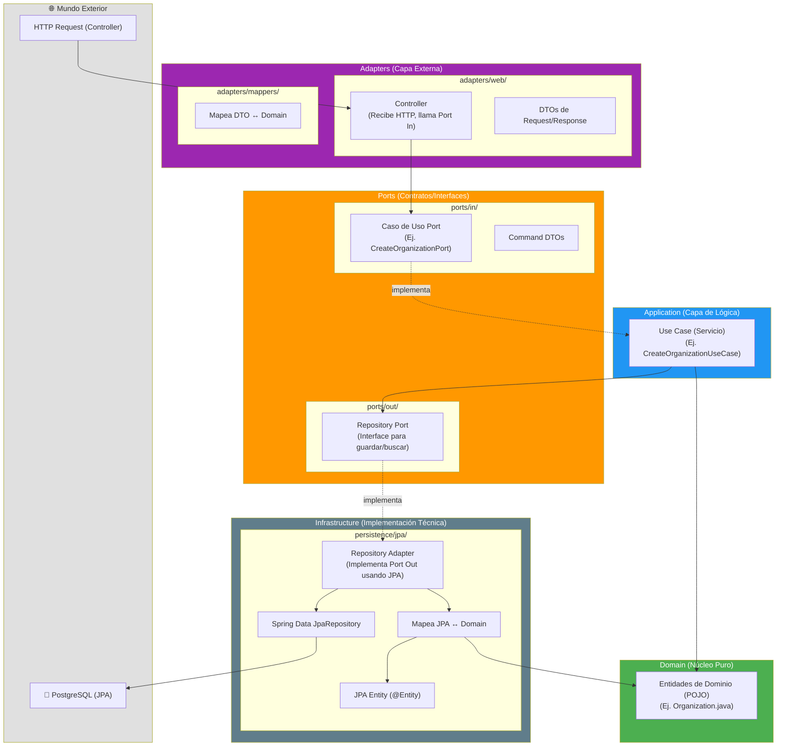

# Arquitectura del Sistema — resto-dev

Este documento sirve como el "mapa" oficial del proyecto para no perderse a medida que crezca. Define cómo fluyen los datos, la separación de responsabilidades en Arquitectura Hexagonal y la estrategia multitenant con PostgreSQL.

---

## 1. Estrategia Multitenant y Base de Datos

El sistema usa una base de datos única (`resto_dev`) pero separa los datos lógicamente usando **Schemas de PostgreSQL**.

| Schema | Tablas | Propósito | ¿Quién lo usa? |
|---|---|---|---|
| `public` | `users`, `organizations`, `roles`, `permissions`, `role_permissions`, `organization_members`, `subscription_plans`, `organization_subscriptions` | **Tablas Maestras / Globales**. Gestionan el acceso al SaaS y la facturación. | El panel de control global (Súper Admins) y el login de usuarios. |
| `client_{uuid}` | (Futuro) `tables`, `categories`, `products`, `orders`, `payments`, etc. | **Tablas Operativas**. Contienen la info diaria exclusiva de cada organización. | El punto de venta (POS) y la gestión local de cada cliente. |

> **Nota:** Cuando se crea una [Organization](file:///c:/Users/casve/Documents/2025-1-UNI/Codlix/resto-dev/resto-dev/src/main/java/resto_dev/modules/adminsaas/organizations/domain/Organization.java#13-30) mediante [OrganizationController](file:///c:/Users/casve/Documents/2025-1-UNI/Codlix/resto-dev/resto-dev/src/main/java/resto_dev/modules/adminsaas/organizations/adapters/web/OrganizationController.java#26-65), un servicio interno ([SchemaService](file:///c:/Users/casve/Documents/2025-1-UNI/Codlix/resto-dev/resto-dev/src/main/java/resto_dev/shared/tenancy/SchemaService.java#12-62)) genera automáticamente un nuevo schema tipo `client_e7f3a9b1c2d4` en la BD.

---

## 2. Estructura General de Módulos (Packages)

Todo el código fuente vive dentro de `src/main/java/resto_dev/`. 

---

## 3. Arquitectura Hexagonal (Dentro de cada módulo)

Cada módulo (ej. `users`, `organizations`) sigue Arquitectura Hexagonal estricta ("Ports and Adapters"). 

### Reglas de Oro de esta Arquitectura:
1. **El Dominio manda:** `Domain` son POJOs puros de Java. No tienen anotaciones de JPA (`@Entity`), ni de Spring. No dependen de **nada**.
2. **Dependencias hacia adentro:** `Adapters` depende de `Ports`. `Application` depende de `Ports` y `Domain`. Nada depende de `Infrastructure` ni `Adapters` hacia afuera.
3. **Inversión de Control:** La capa de `Application` no inyecta un Repositorio JPA. Inyecta la interfaz `OrganizationRepositoryPort`. La implementación está en `Infrastructure` (`OrganizationRepositoryAdapter`), que conecta con Spring Data JPA. Esto permite cambiar de base de datos sin tocar la lógica de negocio.

---

## 4. Flujo de Control de Acceso (Seguridad)

El sistema usa JWT sin estado. Así funciona:

1. **Login:** `POST /api/v1/auth/login`. Valida email/pwd. Genera un token JWT que contiene el ID del usuario (`sub`) y si es súper admin (`superAdmin`).
2. **Autenticación (cada request):** `JwtAuthFilter` intercepta peticiones. Extrae el JWT, lo valida y setea el `SecurityContext` de Spring.
3. **Contexto Multi-tenant (Futuro):** Cuando un usuario de un restaurante en particular inicie su jornada, enviará un header `X-Tenant-ID` (u organizationId en el token temporal). El `TenantContext` interceptará esto para enrutar las consultas de Hibernate al respectivo schema `client_{uuid}`.
4. **Autorización granular (Restaurantes):** La tabla maestra `organization_members` (pivote) enlaza a un Usuario con una Organización y un Rol (que tiene Permisos). Cuando el usuario intente hacer algo en ese restaurante, se validarán sus permisos consultando esta tabla.
