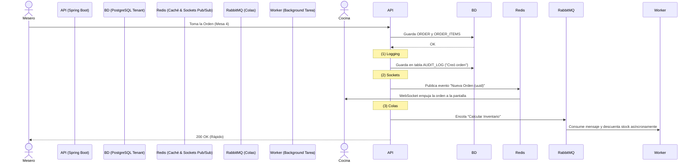

# Expanding the Architecture para Escalar

Has hecho una excelente pregunta. Pensando a futuro, cuando tengas no 1, sino 100 o 1,000 restaurantes usando tu SaaS simultáneamente, la base de datos no es suficiente por sí sola. **Para que el sistema se sienta vivo y no colapse under load, definitivamente necesitas WebSockets, Colas y Logs.**

Aquí te explico exactamente **por qué**, **cuándo**, y **dónde** entra cada pieza en el diagrama de arquitectura:

---

## 1. WebSockets (Comunicación en Tiempo Real)

**¿Es necesario?** Absolutamente SÍ. En un restaurante, la latencia cuesta dinero y quejas.

*   **El problema sin Sockets:** Imagina al cocinero (KDS - Kitchen Display System) dándole "F5" (refrescar) a una pantalla cada 5 segundos para ver si el mesero tomó un nuevo pedido. Esto satura la base de datos (hace consultas tontas a cada rato) y la comida se retrasa.
*   **La solución (Sockets):** El mesero toma el pedido en la Mesa 4 y presiona "Enviar". El servidor procesa la orden, la guarda, y *automáticamente* empuja un evento vía WebSocket (`/topic/kitchen/client_a1b2`) hacia la pantalla de la cocina. La orden aparece mágicamente sin que el cocinero toque nada.
*   **Casos de uso clave:**
    *   Sincronización Mesero ↔ Cocina.
    *   Sincronización Cocina ↔ Pantalla de pedidos listos para recoger (si es comida rápida).
    *   Sincronización del Cajero (si una mesa pagó, las demás tablets deben ver la mesa en verde inmediatamente).

---

## 2. Colas de Mensajes / Message Brokers (RabbitMQ o Kafka)

**¿Es necesario?** Sí, para la resiliencia y tareas "pesadas" que no deben bloquear al usuario.

*   **El problema sin Colas:** Si un cliente paga online o pides emitir una factura electrónica (SUNAT/AFIP/SRI), el hilo (thread) de Spring Boot se queda esperando a que el servidor de impuestos responda. Si el servidor de la entidad tributaria está lento, tu mesero se queda mirando una pantalla cargando en el restaurante. Peor aún, si falla en ese segundo, la factura se pierde.
*   **La solución (Colas):** El mesero cobra la mesa. El servidor la guarda como pagada y envía un evento a una cola (RabbitMQ/Kafka) que dice `CrearFacturaEvent`. El mesero recibe el "OK" en 50 milisegundos. Por detrás, un *Worker* invisible lee la cola y con calma se conecta a la entidad tributaria. Si falla, la cola lo reintenta automáticamente a los 5 minutos sin molestar a nadie.
*   **Casos de uso clave:**
    *   Generación de reportes mensuales para los dueños (PDFs, Excels pesados).
    *   Emisión de facturas electrónicas.
    *   Emails transaccionales (enviar el ticket por correo al comensal).
    *   Sincronización con apps de delivery externas (UberEats, Rappi).

---

## 3. Audit Logs (Registros de Auditoría)

**¿Es necesario?** CRÍTICO para un negocio donde se maneja dinero e inventario.

*   **El problema sin Logs:** Al final del turno la caja no cuadra o desapareció una botella de vino caro. El dueño del restaurante te llamará furioso preguntando "¿Quién borró esta orden?" o "¿Quién modificó este pago?". Si solo actualizaste o borraste un registro en la BD, esa información se perdió para siempre.
*   **La solución (Audit Logs):** *Nunca se borra nada realmente*. Cada vez que alguien hace un `UPDATE` o `DELETE` crítico, se guarda una copia del "Antes" y "Después", con la fecha, hora, y la `UUID` del usuario que lo hizo, además de su dirección IP (si es relevante).
*   **Opciones de Implementación:**
    1.  **A nivel de código (Spring Data Envers / Hibernate Envers):** Hibernate automáticamente crea una tabla `ORDER_AUD` y guarda ahí los históricos.
    2.  **Tabla manual de eventos (Event Sourcing):** Una tabla `AUDIT_LOG` en el esquema del tenant que guarda `entity_name`, `entity_id`, `action (CREATE/UPDATE/DELETE)`, `changes_json`, `user_id`.

---

## Resumen del Flujo Futuro Ideal

