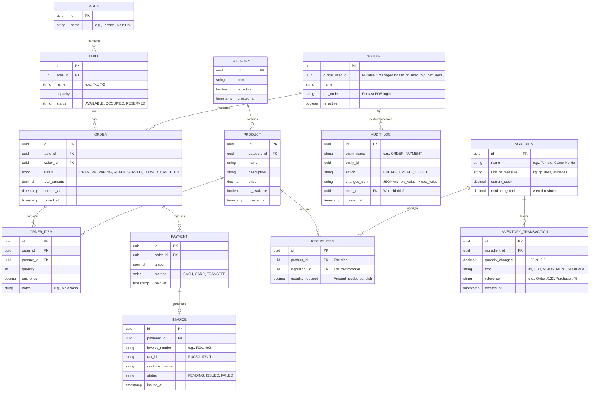

# Tenant Database Schema Design

This document outlines the proposed database schema for a **single tenant** (e.g., `client_a1b2`). Since the application uses a multi-tenant architecture with separate schemas per restaurant, these tables will be replicated inside each tenant's specific schema in PostgreSQL.

## Entity Relationship Diagram (ERD)

### ¿Qué agregamos a la Base de Datos para soportar el futuro crecimiento?

1. **Tabla `AUDIT_LOG` (Seguridad y Trazabilidad)**: 
   Tal como lo discutimos, esta tabla es sagrada. Si un mesero o administrador borra una orden (`action: "DELETE"`), o cambia un pago de S/100 a S/10 (`action: "UPDATE"`), todo queda registrado en formato JSON (`changes_json`) vinculando la acción al `user_id` exacto. Al ser una tabla que solo crece y nunca se actualiza, es ultra rápida para insertar datos.

2. **Tabla `INVOICE` (Integración con Facturación Electrónica / Colas)**:
   Cuando el cliente pide factura, no deberíamos bloquear el hilo de Java esperando que la SUNAT responda. Se crea un registro en `INVOICE` con estado `PENDING`. El worker de RabbitMQ manda el XML y si la SUNAT devuelve "OK", el worker actualiza esta tabla a estado `ISSUED` y guarda el `invoice_number` oficial.

3. **Modificaciones Menores que podrías considerar (Dependiendo de la madurez):**
   *   **Control de Inventario**: Una tabla extra `INVENTORY_TRANSACTION` si quieres descontar ingredientes exactos (ej: restar 150g de carne por cada hamburguesa vendida).
   *   **Caja / Cierre de Turno**: Una tabla `CASH_REGISTER_SESSION` para que el mesero "abra" su caja con S/50 en la mañana y rinda cuentas en la noche. 

## How this solves your requirements:

1. **Gestión de Órdenes y Pedidos (`ORDER`, `ORDER_ITEM`)**: 
   Cada orden está anclada a una Mesa (`TABLE`) y contiene múltiples productos. El estado (`status`) permite llevar el flujo: desde que se abre, se prepara en cocina, se sirve y se cobra.

2. **Gestión de Meseros (`WAITER`)**:
   Las órdenes están vinculadas al mesero que las atendió (`waiter_id`). Esto permite saber exactamente quién tomó qué pedido. Además, los meseros tienen un `pin_code` para que puedan loguearse rápidamente en la tablet del restaurante sin escribir un email/password largo.

3. **Estadísticas para los Dueños (Analytics)**:
   Gracias a esta estructura, el dueño puede obtener métricas súper valiosas haciendo *queries* directas en su esquema. Ejemplos de **Métricas que se pueden sacar automáticamente**:
   - **Ventas totales por día/mes:** Sumando los montos en la tabla `PAYMENT`.
   - **Mesero estrella:** Agrupando `ORDER` por `waiter_id` y sumando el `total_amount` generado por cada uno.
   - **Productos más vendidos:** Sumando la cantidad (`quantity`) en `ORDER_ITEM` agrupado por `product_id`.
   - **Rotación de mesas:** Calculando la diferencia de tiempo entre `opened_at` y `closed_at` en `ORDER` para saber qué tan rápido se desocupan las mesas.
   - **Hora pico:** Contando cuántas órdenes se abren por hora en `opened_at`.
